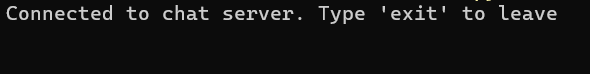
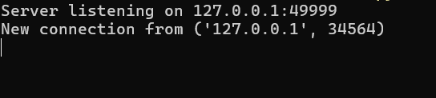
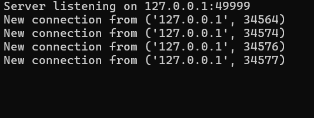
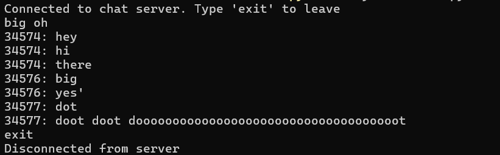

Assignment 2

Use 1 terminal for the server and as many for the clients. To start the server, use the cmd

python mychatserver.py

In the other terminals, use cmd python mychatclient.py

Output on server will be this:

Server listening on 127.0.0.1:49999

For testing purposes, there are 4 clients. Run the cmds to get this output to show connection successful

On the server side

To manually stop the server, use the cmds Get-Process -Name python to get the id then use Stop-Process -Id #.

