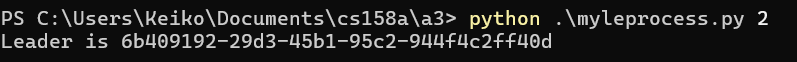

Assignment 3

For testing purposes, run the cmds python myleprocess.py and add a line number (eg 1, 2, ...) corresponding

to the intented ip and port line on config file. I will be using test_config to demonstrate the 3 processes

in demo.

Example run:

To stop the process, use the cmds Get-Process -Name python and just kill it with the corresponding id

number. 

The processes will log the messages to the txt file. Note, might have to wait for a few seconds as the 

leader election proceeds otherwise one node might not get the leader message.

